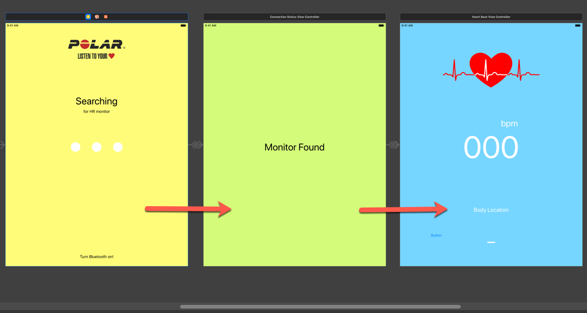
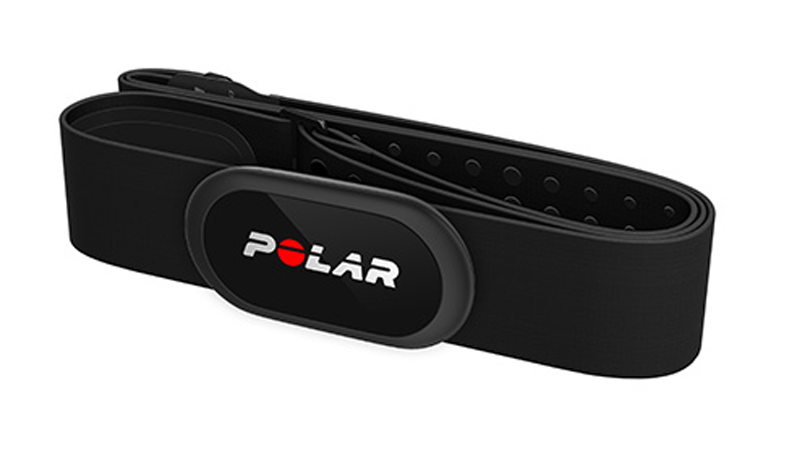

# Bluetooth-Demo
This is a demo to demonstrate how to get a heart rate from a Polar Monitor.

## Compatability
Swift ver: **Swift 5**
deployment target: **iOS 12.4**
device: **iPad**
orientation: **Portrait**
At the time I only had an iPad available for development and testing.

## Technologies

Core Bluetooth https://developer.apple.com/documentation/corebluetooth

Delegation https://developer.apple.com/library/archive/documentation/General/Conceptual/DevPedia-CocoaCore/Delegation.html

NotificationCenter https://developer.apple.com/documentation/foundation/notificationcenter

Grand Central Dispatch https://developer.apple.com/documentation/DISPATCH

## HR Monitor Compatability

 This app has only been tested with the following Polar heart rate monitors: 

### **Polar H7**, **Polar H10**

## Flow

1. The app will start on the "Searching" view. It'll stay there until a HR monitor is detected.

2. Once a monitor has been found, the navigation controller will push the "Monitor Found" view on to the stack. That view will persist until a valid heart rate starts coming through. From my testing I can confirm that it pushes a heart rate of 0 for the first 10 seconds, then it will start pushing the actual heart rate.

3. Once that a valid heart rate is received the navigation controller will push the "HeartRate" view on to the stack and the heart image will start pulsating with the users heartbeat.

## No signal

The app is checking for a heartbeat continuously. If it stops detecting a heartrate the navigation controller will pop both views using delegation and show the root view (Searching view). 

